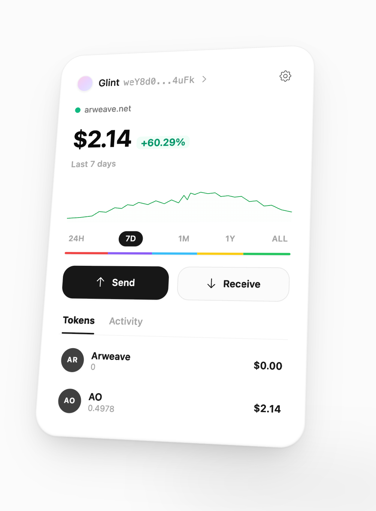

# Gleam



A Chrome browser-extension wallet for Arweave and AO. Password-protected key
vault, AR and AO balances, send/receive, a merged activity feed, tagged
Arweave uploads, and an ArConnect-compatible `window.arweaveWallet`
provider — every dApp signing request opens its own approval window with a
decoded preview.

## Getting started

```bash
pnpm install
pnpm dev            # WXT dev build with live reload
```

Load `apps/extension/.output/chrome-mv3` unpacked in Chrome to try it.

```bash
pnpm wxt:build                             # production build
pnpm vitest run                            # tests
pnpm tsc -p packages/core --noEmit         # also: packages/messaging, packages/ui, apps/extension
pnpm eslint --max-warnings=0 .
```


## License

[MIT](LICENSE)
